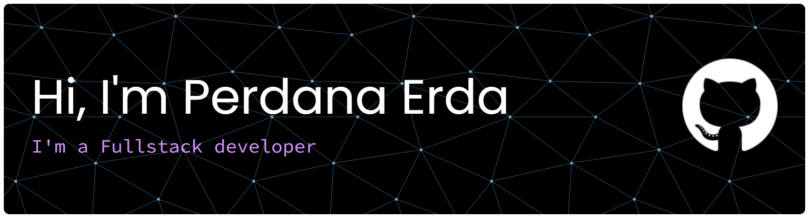

<!-- # Hi there, I'm Perdana Wahyu 🐦‍🔥 -->
##  Welcome to my GitHub Profile 👋

# 💻 Tech Stack:
                  

#### About me :
* I'm currently available for Work 💼
* I'm confident in using PHP / Laravel 
* I can work with Javascript to (NextJS, VueJS)
* Very passionate to Learn
* How to easly reach me :  

#### Connect with me :

